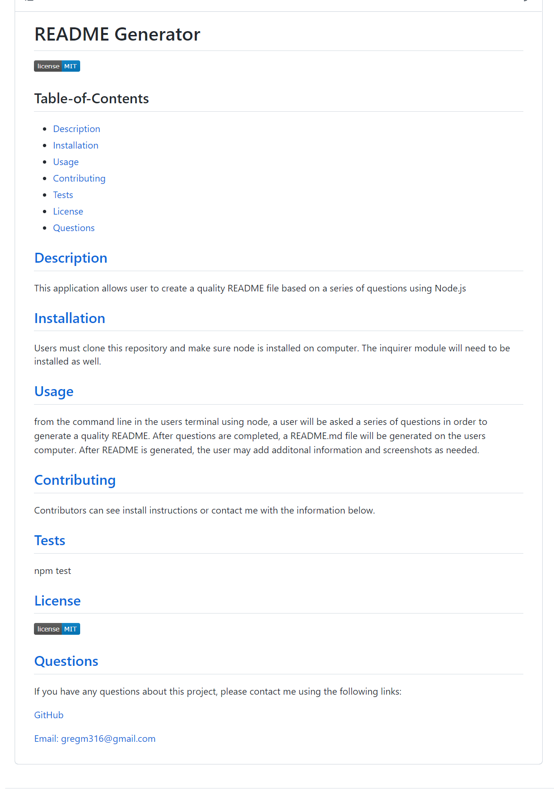

# README Generator

## Table-of-Contents

- [Description](#description)
- [Installation](#installation)
- [Usage](#usage)
- [Contributing](#contributing)
- [Tests](#tests)
- [License](#license)
- [Questions](#questions)

## [Description](#table-of-contents)

This application allows user to create a quality README file based on a series of questions using Node.js

## [Installation](#table-of-contents)

Users must clone this repository and make sure node is installed on computer. The inquirer module will need to be installed as well.

## [Usage](#table-of-contents)

from the command line in the users terminal using node, a user will be asked a series of questions in order to generate a quality README. After questions are completed, a README.md file will be generated on the users computer. After README is generated, the user may add additonal information and screenshots as needed.

### Screenshot of Generated README:

### Link to Demo Video:
https://drive.google.com/file/d/1SPh0SkR6JWSnNGdncusOE0V_uDd0LCT-/view

## [Contributing](#table-of-contents)

Contributors can see install instructions or contact me with the information below.

## [Tests](#table-of-contents)

npm test

## [License](#table-of-contents)

## [Questions](#table-of-contents)

If you have any questions about this project, please contact me using the following links:

[GitHub](https://github.com/Gregm316)

[Email: gregm316@gmail.com](mailto:gregm316@gmail.com)
